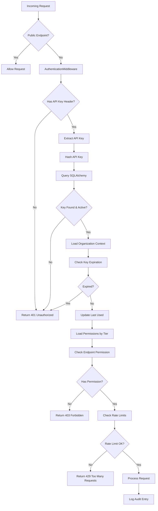

# 🔐 План внедрения API Key авторизации в RAG Construction Materials API

**Версия:** 2.0  
**Дата создания:** 2025-01-16  
**Автор:** AI Assistant  
**Статус:** Планируется к реализации  
**Технологии:** FastAPI + SQLAlchemy + PostgreSQL

## 📋 Содержание

1. [Анализ текущей архитектуры](#анализ-текущей-архитектуры)
2. [API Key Authentication архитектура](#api-key-authentication-архитектура)
3. [Структура базы данных](#структура-базы-данных)
4. [Структура реализации](#структура-реализации)
5. [План поэтапного внедрения](#план-поэтапного-внедрения)
6. [Интеграция с существующими компонентами](#интеграция-с-существующими-компонентами)
7. [Мониторинг и безопасность](#мониторинг-и-безопасность)
8. [Тестирование](#тестирование)

## 🏗️ Анализ текущей архитектуры

### Существующие компоненты безопасности:
- ✅ `SecurityMiddleware` - защита от атак, валидация входных данных
- ✅ `RateLimitMiddleware` - ограничение запросов по IP
- ✅ `LoggingMiddleware` - логирование всех запросов
- ✅ CORS настройки по окружениям
- ✅ Валидация размера запросов (50MB)
- ✅ Защита от SQL injection, XSS, Path traversal

### Отсутствующие компоненты:
- ❌ Аутентификация клиентов через API ключи
- ❌ Авторизация доступа к ресурсам
- ❌ Управление API ключами в PostgreSQL
- ❌ Ролевая модель доступа для B2B клиентов
- ❌ Дифференцированные лимиты по API ключам

## 🎯 Варианты авторизации

### API Key Authentication для B2B интеграций

**Преимущества для нашего случая:**
- ✅ Простота реализации с FastAPI + SQLAlchemy
- ✅ Идеален для B2B интеграций со стройматериалами  
- ✅ Высокая производительность (без сложной JWT обработки)
- ✅ Надежное хранение в PostgreSQL
- ✅ Легко масштабируется и управляется
- ✅ Подходит для долгосрочных клиентских интеграций
- ✅ Простое управление через админку
- ✅ Возможность легкого отзыва и ротации ключей

**Архитектурные принципы:**
- API ключи хранятся в PostgreSQL через SQLAlchemy models
- Каждый API ключ привязан к конкретному клиенту/организации
- Ролевая модель на уровне API ключей (basic, premium, enterprise) 
- Встроенный rate limiting по уровням доступа
- Полный аудит использования API ключей
- Автоматическая генерация и хеширование ключей

## 🗄️ Структура базы данных

### SQLAlchemy модели для API Key Authentication

```python
# app/models/auth.py
from sqlalchemy import Column, Integer, String, DateTime, Boolean, Text, ForeignKey, Enum
from sqlalchemy.orm import relationship
from sqlalchemy.sql import func
import enum
from typing import Optional

from core.database import Base

class APIKeyTier(str, enum.Enum):
    """Уровни доступа API ключей"""
    BASIC = "basic"
    PREMIUM = "premium" 
    ENTERPRISE = "enterprise"

class ClientOrganization(Base):
    """Модель организации-клиента"""
    __tablename__ = "client_organizations"
    
    id = Column(Integer, primary_key=True, index=True)
    name = Column(String(255), nullable=False, index=True)
    description = Column(Text, nullable=True)
    contact_email = Column(String(255), nullable=False)
    contact_person = Column(String(255), nullable=True)
    is_active = Column(Boolean, default=True, nullable=False)
    created_at = Column(DateTime(timezone=True), server_default=func.now())
    updated_at = Column(DateTime(timezone=True), onupdate=func.now())
    
    # Relationships
    api_keys = relationship("APIKey", back_populates="organization", cascade="all, delete-orphan")
    audit_logs = relationship("APIKeyAuditLog", back_populates="organization")

class APIKey(Base):
    """Модель API ключей"""
    __tablename__ = "api_keys"
    
    id = Column(Integer, primary_key=True, index=True)
    key_hash = Column(String(255), unique=True, nullable=False, index=True)  # SHA-256 hash
    key_prefix = Column(String(20), nullable=False, index=True)  # Первые символы для идентификации
    name = Column(String(255), nullable=False)  # Человекочитаемое имя ключа
    tier = Column(Enum(APIKeyTier), nullable=False, default=APIKeyTier.BASIC)
    
    # Organization relationship
    organization_id = Column(Integer, ForeignKey("client_organizations.id"), nullable=False)
    organization = relationship("ClientOrganization", back_populates="api_keys")
    
    # Status and validity
    is_active = Column(Boolean, default=True, nullable=False)
    expires_at = Column(DateTime(timezone=True), nullable=True)  # Optional expiration
    last_used_at = Column(DateTime(timezone=True), nullable=True)
    
    # Rate limiting overrides (если нужны индивидуальные лимиты)
    custom_rpm_limit = Column(Integer, nullable=True)  # Requests per minute override
    custom_rph_limit = Column(Integer, nullable=True)  # Requests per hour override
    
    # Metadata
    created_at = Column(DateTime(timezone=True), server_default=func.now())
    updated_at = Column(DateTime(timezone=True), onupdate=func.now())
    created_by = Column(String(255), nullable=True)  # Admin who created the key
    notes = Column(Text, nullable=True)  # Admin notes
    
    # Relationships
    audit_logs = relationship("APIKeyAuditLog", back_populates="api_key", cascade="all, delete-orphan")

class APIKeyAuditLog(Base):
    """Аудит использования API ключей"""
    __tablename__ = "api_key_audit_logs"
    
    id = Column(Integer, primary_key=True, index=True)
    
    # API Key reference
    api_key_id = Column(Integer, ForeignKey("api_keys.id"), nullable=False)
    api_key = relationship("APIKey", back_populates="audit_logs")
    
    # Organization reference (денормализация для быстрых запросов)
    organization_id = Column(Integer, ForeignKey("client_organizations.id"), nullable=False)
    organization = relationship("ClientOrganization", back_populates="audit_logs")
    
    # Request details
    endpoint = Column(String(255), nullable=False, index=True)
    method = Column(String(10), nullable=False)
    status_code = Column(Integer, nullable=False)
    response_time_ms = Column(Integer, nullable=True)
    
    # Client info
    client_ip = Column(String(45), nullable=True, index=True)  # IPv6 compatible
    user_agent = Column(Text, nullable=True)
    
    # Timestamp
    timestamp = Column(DateTime(timezone=True), server_default=func.now(), index=True)
    
    # Additional metadata
    request_size_bytes = Column(Integer, nullable=True)
    response_size_bytes = Column(Integer, nullable=True)
    error_message = Column(Text, nullable=True)  # For failed requests
```

### Database Migration (Alembic)

```python
# alembic/versions/001_add_api_key_auth.py
"""Add API Key authentication tables

Revision ID: 001_api_key_auth
Revises: base
Create Date: 2025-01-16

"""
from alembic import op
import sqlalchemy as sa

def upgrade():
    # Create client_organizations table
    op.create_table('client_organizations',
        sa.Column('id', sa.Integer(), nullable=False),
        sa.Column('name', sa.String(length=255), nullable=False),
        sa.Column('description', sa.Text(), nullable=True),
        sa.Column('contact_email', sa.String(length=255), nullable=False),
        sa.Column('contact_person', sa.String(length=255), nullable=True),
        sa.Column('is_active', sa.Boolean(), nullable=False, default=True),
        sa.Column('created_at', sa.DateTime(timezone=True), server_default=sa.func.now()),
        sa.Column('updated_at', sa.DateTime(timezone=True), onupdate=sa.func.now()),
        sa.PrimaryKeyConstraint('id')
    )
    op.create_index('ix_client_organizations_name', 'client_organizations', ['name'])
    
    # Create api_keys table
    op.create_table('api_keys',
        sa.Column('id', sa.Integer(), nullable=False),
        sa.Column('key_hash', sa.String(length=255), nullable=False),
        sa.Column('key_prefix', sa.String(length=20), nullable=False),
        sa.Column('name', sa.String(length=255), nullable=False),
        sa.Column('tier', sa.Enum('basic', 'premium', 'enterprise', name='apikeytier'), nullable=False),
        sa.Column('organization_id', sa.Integer(), nullable=False),
        sa.Column('is_active', sa.Boolean(), nullable=False, default=True),
        sa.Column('expires_at', sa.DateTime(timezone=True), nullable=True),
        sa.Column('last_used_at', sa.DateTime(timezone=True), nullable=True),
        sa.Column('custom_rpm_limit', sa.Integer(), nullable=True),
        sa.Column('custom_rph_limit', sa.Integer(), nullable=True),
        sa.Column('created_at', sa.DateTime(timezone=True), server_default=sa.func.now()),
        sa.Column('updated_at', sa.DateTime(timezone=True), onupdate=sa.func.now()),
        sa.Column('created_by', sa.String(length=255), nullable=True),
        sa.Column('notes', sa.Text(), nullable=True),
        sa.PrimaryKeyConstraint('id'),
        sa.ForeignKeyConstraint(['organization_id'], ['client_organizations.id'])
    )
    op.create_index('ix_api_keys_key_hash', 'api_keys', ['key_hash'], unique=True)
    op.create_index('ix_api_keys_key_prefix', 'api_keys', ['key_prefix'])
    
    # Create audit log table
    op.create_table('api_key_audit_logs',
        sa.Column('id', sa.Integer(), nullable=False),
        sa.Column('api_key_id', sa.Integer(), nullable=False),
        sa.Column('organization_id', sa.Integer(), nullable=False),
        sa.Column('endpoint', sa.String(length=255), nullable=False),
        sa.Column('method', sa.String(length=10), nullable=False),
        sa.Column('status_code', sa.Integer(), nullable=False),
        sa.Column('response_time_ms', sa.Integer(), nullable=True),
        sa.Column('client_ip', sa.String(length=45), nullable=True),
        sa.Column('user_agent', sa.Text(), nullable=True),
        sa.Column('timestamp', sa.DateTime(timezone=True), server_default=sa.func.now()),
        sa.Column('request_size_bytes', sa.Integer(), nullable=True),
        sa.Column('response_size_bytes', sa.Integer(), nullable=True),
        sa.Column('error_message', sa.Text(), nullable=True),
        sa.PrimaryKeyConstraint('id'),
        sa.ForeignKeyConstraint(['api_key_id'], ['api_keys.id']),
        sa.ForeignKeyConstraint(['organization_id'], ['client_organizations.id'])
    )
    op.create_index('ix_api_key_audit_logs_endpoint', 'api_key_audit_logs', ['endpoint'])
    op.create_index('ix_api_key_audit_logs_client_ip', 'api_key_audit_logs', ['client_ip'])
    op.create_index('ix_api_key_audit_logs_timestamp', 'api_key_audit_logs', ['timestamp'])

def downgrade():
    op.drop_table('api_key_audit_logs')
    op.drop_table('api_keys')
    op.drop_table('client_organizations')
    op.execute('DROP TYPE apikeytier')
```

### 2. JWT Token Authentication (Для пользовательских приложений)

**Преимущества:**
- Stateless аутентификация
- Поддержка refresh tokens
- Детализированные claims
- Интеграция с OAuth2

**Недостатки:**
- Сложнее реализация
- Управление секретными ključами

### 3. Hybrid Authentication (Рекомендуемый для продакшн)

**Комбинация:**
- API Keys для сервис-к-сервис взаимодействия
- JWT для пользовательских интерфейсов
- OAuth2 для внешних интеграций

## 🏗️ Компоненты системы

### Структура модулей API Key авторизации:

```
core/auth/
├── __init__.py
├── api_key.py          # API key authentication и генерация
├── permissions.py      # Permissions и roles  
├── middleware.py       # Authentication middleware
├── dependencies.py     # FastAPI dependencies
├── models.py          # Pydantic response models
├── exceptions.py      # Auth exceptions
└── repository.py      # SQLAlchemy repository для API keys

app/models/
└── auth.py            # SQLAlchemy модели (APIKey, ClientOrganization, etc.)

app/repositories/
└── auth_repository.py # Репозиторий для работы с API ключами
```

### Схема API Key авторизации:



## 🔧 Структура реализации

### 1. Конфигурация (core/config.py)

```python
# API Key Authentication settings
ENABLE_AUTHENTICATION: bool = True
API_KEY_HEADER: str = "X-API-Key"
API_KEY_HASH_ALGORITHM: str = "sha256"  # Алгоритм хеширования ключей
API_KEY_PREFIX_LENGTH: int = 12  # Длина префикса для идентификации

# Protected endpoints
PROTECTED_ENDPOINTS: List[str] = [
    "/api/v1/materials",
    "/api/v1/prices", 
    "/api/v1/search",
    "/api/v1/advanced_search",
    "/api/v1/upload"
]

PUBLIC_ENDPOINTS: List[str] = [
    "/api/v1/health",
    "/api/v1/reference",
    "/docs",
    "/openapi.json",
    "/api/v1/auth/login"  # Если добавим админ интерфейс
]

# API Key tiers с permissions и rate limits
API_KEY_TIERS = {
    "basic": {
        "permissions": [
            "materials:read",
            "prices:read", 
            "search:basic"
        ],
        "rate_limits": {
            "rpm": 30,   # requests per minute
            "rph": 500,  # requests per hour
            "burst": 10  # burst capacity
        },
        "description": "Базовый доступ для чтения данных"
    },
    "premium": {
        "permissions": [
            "materials:read",
            "materials:write",
            "prices:read",
            "prices:write",
            "search:basic",
            "search:advanced"
        ],
        "rate_limits": {
            "rpm": 100,
            "rph": 2000,
            "burst": 50
        },
        "description": "Расширенный доступ с возможностью записи"
    },
    "enterprise": {
        "permissions": [
            "materials:*",  # Все права на материалы
            "prices:*",     # Все права на цены
            "search:*",     # Все права на поиск
            "files:upload", # Загрузка файлов
            "admin:read"    # Чтение админ данных
        ],
        "rate_limits": {
            "rpm": 1000,
            "rph": 20000,
            "burst": 200
        },
        "description": "Полный доступ для корпоративных клиентов"
    }
}

# Database настройки для аудита
API_KEY_AUDIT_RETENTION_DAYS: int = 90  # Хранение аудит логов
API_KEY_DEFAULT_EXPIRY_DAYS: int = 365  # Срок действия ключей по умолчанию
API_KEY_AUTO_DISABLE_INACTIVE_DAYS: int = 30  # Автоотключение неактивных ключей
```

### 2. Permissions система (core/auth/permissions.py)

```python
from enum import Enum
from typing import List, Dict, Any

class Permission(str, Enum):
    # Materials permissions
    READ_MATERIALS = "materials:read"
    WRITE_MATERIALS = "materials:write"
    DELETE_MATERIALS = "materials:delete"
    ADMIN_MATERIALS = "materials:admin"
    
    # Prices permissions
    READ_PRICES = "prices:read"
    WRITE_PRICES = "prices:write"
    UPLOAD_PRICES = "prices:upload"
    
    # Search permissions
    BASIC_SEARCH = "search:basic"
    ADVANCED_SEARCH = "search:advanced"
    
    # File permissions
    UPLOAD_FILES = "files:upload"
    
    # Admin permissions
    ADMIN_ALL = "admin:all"

class Role(str, Enum):
    VIEWER = "viewer"          # Только чтение
    EDITOR = "editor"          # Чтение + запись
    UPLOADER = "uploader"      # Загрузка файлов
    ADMIN = "admin"            # Полный доступ
    INTEGRATION = "integration" # Для внешних систем

ROLE_PERMISSIONS: Dict[Role, List[Permission]] = {
    Role.VIEWER: [
        Permission.READ_MATERIALS,
        Permission.READ_PRICES,
        Permission.BASIC_SEARCH
    ],
    Role.EDITOR: [
        Permission.READ_MATERIALS,
        Permission.WRITE_MATERIALS,
        Permission.READ_PRICES,
        Permission.WRITE_PRICES,
        Permission.BASIC_SEARCH,
        Permission.ADVANCED_SEARCH
    ],
    Role.UPLOADER: [
        Permission.READ_MATERIALS,
        Permission.WRITE_MATERIALS,
        Permission.UPLOAD_FILES,
        Permission.UPLOAD_PRICES,
        Permission.BASIC_SEARCH
    ],
    Role.ADMIN: [
        Permission.ADMIN_ALL
    ],
    Role.INTEGRATION: [
        Permission.READ_MATERIALS,
        Permission.WRITE_MATERIALS,
        Permission.READ_PRICES,
        Permission.BASIC_SEARCH,
        Permission.ADVANCED_SEARCH
    ]
}
```

### 3. Authentication Middleware (core/auth/middleware.py)

```python
import time
import logging
from typing import Optional, Dict, Any, List
from fastapi import Request, Response, HTTPException
from starlette.middleware.base import BaseHTTPMiddleware
from starlette.responses import JSONResponse

from core.config import settings
from .api_key import APIKeyAuth
from .jwt_auth import JWTAuth
from .exceptions import AuthenticationError, AuthorizationError

logger = logging.getLogger(__name__)

class AuthenticationMiddleware(BaseHTTPMiddleware):
    """
    Unified authentication middleware supporting multiple auth methods.
    """
    
    def __init__(
        self,
        app,
        protected_paths: List[str],
        public_paths: List[str],
        auth_type: str = "hybrid"
    ):
        super().__init__(app)
        self.protected_paths = protected_paths
        self.public_paths = public_paths
        self.auth_type = auth_type
        
        # Initialize auth handlers
        self.api_key_auth = APIKeyAuth()
        self.jwt_auth = JWTAuth()
    
    async def dispatch(self, request: Request, call_next) -> Response:
        # Check if endpoint is public
        if self._is_public_endpoint(request.url.path):
            return await call_next(request)
        
        # Check if endpoint needs protection
        if not self._is_protected_endpoint(request.url.path):
            return await call_next(request)
        
        try:
            # Authenticate user
            user_context = await self._authenticate_request(request)
            if not user_context:
                return self._create_auth_error_response("Authentication required")
            
            # Add user context to request state
            request.state.user = user_context
            request.state.is_authenticated = True
            
            # Process request
            response = await call_next(request)
            
            # Add auth headers to response
            self._add_auth_headers(response, user_context)
            
            return response
            
        except AuthenticationError as e:
            return self._create_auth_error_response(str(e), 401)
        except AuthorizationError as e:
            return self._create_auth_error_response(str(e), 403)
        except Exception as e:
            logger.error(f"Authentication middleware error: {e}")
            return self._create_auth_error_response("Authentication failed", 500)
    
    async def _authenticate_request(self, request: Request) -> Optional[Dict[str, Any]]:
        """Try different authentication methods based on configuration."""
        
        if self.auth_type in ["api_key", "hybrid"]:
            # Try API key authentication
            api_key = request.headers.get("X-API-Key")
            if api_key:
                user_context = await self.api_key_auth.authenticate(api_key)
                if user_context:
                    return user_context
        
        if self.auth_type in ["jwt", "hybrid"]:
            # Try JWT authentication
            auth_header = request.headers.get("Authorization")
            if auth_header and auth_header.startswith("Bearer "):
                token = auth_header[7:]  # Remove "Bearer " prefix
                user_context = await self.jwt_auth.authenticate(token)
                if user_context:
                    return user_context
        
        return None
    
    def _is_public_endpoint(self, path: str) -> bool:
        """Check if endpoint is public."""
        return any(path.startswith(public_path) for public_path in self.public_paths)
    
    def _is_protected_endpoint(self, path: str) -> bool:
        """Check if endpoint needs protection."""
        return any(path.startswith(protected_path) for protected_path in self.protected_paths)
    
    def _create_auth_error_response(self, message: str, status_code: int = 401) -> JSONResponse:
        """Create standardized auth error response."""
        return JSONResponse(
            status_code=status_code,
            content={
                "error": "Authentication failed" if status_code == 401 else "Authorization failed",
                "message": message,
                "timestamp": time.time()
            }
        )
    
    def _add_auth_headers(self, response: Response, user_context: Dict[str, Any]):
        """Add authentication headers to response."""
        response.headers["X-User-ID"] = str(user_context.get("user_id", ""))
        response.headers["X-User-Role"] = user_context.get("role", "")
```

### 4. FastAPI Dependencies (core/auth/dependencies.py)

```python
from fastapi import Depends, HTTPException, Security, Request
from fastapi.security import HTTPBearer, APIKeyHeader
from typing import Optional, Dict, Any

from .permissions import Permission, Role, ROLE_PERMISSIONS
from .exceptions import AuthorizationError

# Security schemes
api_key_header = APIKeyHeader(name="X-API-Key", auto_error=False)
bearer_scheme = HTTPBearer(auto_error=False)

async def get_current_user(request: Request) -> Dict[str, Any]:
    """Get current authenticated user from request state."""
    if not hasattr(request.state, 'is_authenticated') or not request.state.is_authenticated:
        raise HTTPException(status_code=401, detail="Authentication required")
    
    return request.state.user

async def get_optional_user(request: Request) -> Optional[Dict[str, Any]]:
    """Get current user if authenticated, otherwise None."""
    if hasattr(request.state, 'is_authenticated') and request.state.is_authenticated:
        return request.state.user
    return None

def require_permission(permission: Permission):
    """Dependency factory for permission checking."""
    async def permission_checker(current_user: Dict[str, Any] = Depends(get_current_user)):
        user_permissions = current_user.get("permissions", [])
        user_role = current_user.get("role")
        
        # Check if user has admin permission
        if Permission.ADMIN_ALL in user_permissions:
            return True
        
        # Check specific permission
        if permission in user_permissions:
            return True
        
        # Check role-based permissions
        if user_role and user_role in ROLE_PERMISSIONS:
            role_permissions = ROLE_PERMISSIONS[Role(user_role)]
            if permission in role_permissions or Permission.ADMIN_ALL in role_permissions:
                return True
        
        raise HTTPException(
            status_code=403,
            detail=f"Permission '{permission}' required"
        )
    
    return permission_checker

def require_role(role: Role):
    """Dependency factory for role checking."""
    async def role_checker(current_user: Dict[str, Any] = Depends(get_current_user)):
        user_role = current_user.get("role")
        if user_role != role and user_role != Role.ADMIN:
            raise HTTPException(
                status_code=403,
                detail=f"Role '{role}' required"
            )
        return True
    
    return role_checker
```

## 📈 План поэтапного внедрения

### **Фаза 1: Базовая авторизация (2-3 дня)**

**Цель:** Реализовать API Key authentication для основных эндпоинтов

**Задачи:**
1. ✅ Создать модуль `core/auth/`
2. ✅ Реализовать `APIKeyAuth` класс
3. ✅ Создать `AuthenticationMiddleware`
4. ✅ Обновить конфигурацию в `core/config.py`
5. ✅ Добавить middleware в `main.py`
6. ✅ Создать базовые FastAPI dependencies

**Критерии готовности:**
- API ключи проверяются через Redis
- Защищенные эндпоинты требуют авторизации
- Публичные эндпоинты остаются доступными
- Логирование аутентификации работает

### **Фаза 2: Permissions & Roles (1-2 дня)**

**Цель:** Добавить систему ролей и прав доступа

**Задачи:**
1. ✅ Реализовать `Permission` и `Role` enums
2. ✅ Создать `require_permission()` dependency
3. ✅ Обновить существующие роуты с проверками прав
4. ✅ Настроить разные уровни доступа для API ключей
5. ✅ Документировать систему прав в OpenAPI

**Критерии готовности:**
- Разные роли имеют разные права доступа
- API ключи связаны с определенными правами
- Проверка прав работает на уровне эндпоинтов
- Документация прав доступна в Swagger

### **Фаза 3: Интеграция с существующими системами (1-2 дня)**

**Цель:** Интегрировать авторизацию с Rate Limiting и Logging

**Задачи:**
1. ✅ Обновить `RateLimitMiddleware` для учета пользователей
2. ✅ Добавить контекст пользователя в логирование
3. ✅ Настроить дифференцированные лимиты по ролям
4. ✅ Обновить мониторинг и метрики
5. ✅ Добавить аудит авторизации

**Критерии готовности:**
- Rate limiting работает по пользователям/ключам
- Логи содержат информацию о пользователе
- Метрики разделены по пользователям
- Аудит безопасности функционален

### **Фаза 4: JWT Authentication (опционально, 2-3 дня)**

**Цель:** Добавить поддержку JWT токенов для пользовательских приложений

**Задачи:**
1. ✅ Реализовать `JWTAuth` класс
2. ✅ Добавить поддержку refresh tokens
3. ✅ Создать эндпоинты для аутентификации пользователей
4. ✅ Настроить hybrid authentication mode
5. ✅ Добавить управление пользователями (базовое)

**Критерии готовности:**
- JWT токены работают параллельно с API ключами
- Refresh token rotation реализован
- Пользователи могут логиниться через API
- Hybrid режим работает корректно

### **Фаза 5: Тестирование и документация (1-2 дня)**

**Задачи:**
1. ✅ Написать unit тесты для всех auth компонентов
2. ✅ Создать integration тесты
3. ✅ Обновить документацию API
4. ✅ Создать примеры использования
5. ✅ Провести security review

## 🔗 Интеграция с существующими компонентами

### Обновление main.py

```python
# Updated middleware stack order (LIFO):
# 9. CORS (последний)
# 8. Authentication (новый!)
# 7. Rate Limiting (обновленный с user context)
# 6. Logging (обновленный с user context)
# 5. Security 
# 4. Compression
# 3. Body Cache
# 2. Conditional
# 1. Error Handling (первый)

if settings.ENABLE_AUTHENTICATION:
    app.add_middleware(AuthenticationMiddleware,
        protected_paths=settings.PROTECTED_ENDPOINTS,
        public_paths=settings.PUBLIC_ENDPOINTS,
        auth_type=settings.AUTH_TYPE
    )
```

### Обновление роутеров

```python
# api/routes/materials.py
from core.auth.dependencies import get_current_user, require_permission
from core.auth.permissions import Permission

@router.post("/", response_model=Material)
async def create_material(
    material: MaterialCreate,
    current_user: dict = Depends(get_current_user),
    _: None = Depends(require_permission(Permission.WRITE_MATERIALS)),
    service: MaterialsService = Depends(get_materials_service)
):
    """Создание материала - требует права WRITE_MATERIALS"""
    logger.info(f"User {current_user['user_id']} creating material: {material.name}")
    # ... existing logic

@router.get("/", response_model=List[Material])
async def get_materials(
    skip: int = 0,
    limit: int = 10,
    current_user: dict = Depends(get_current_user),
    _: None = Depends(require_permission(Permission.READ_MATERIALS)),
    service: MaterialsService = Depends(get_materials_service)
):
    """Получение материалов - требует права READ_MATERIALS"""
    logger.info(f"User {current_user['user_id']} fetching materials")
    # ... existing logic
```

### Обновление Rate Limiting

```python
# core/middleware/rate_limiting.py
def _get_client_identifier(self, request: Request) -> str:
    """Enhanced client identifier with user context."""
    # Priority: authenticated_user > api_key > ip
    if hasattr(request.state, 'user') and request.state.user:
        user_info = request.state.user
        return f"user:{user_info['user_id']}"
    
    api_key = request.headers.get("X-API-Key")
    if api_key:
        return f"key:{api_key[:16]}"
        
    # Fallback to IP
    return f"ip:{self._get_client_ip(request)}"

def _get_endpoint_limits(self, path: str, user_context: Optional[Dict] = None) -> Dict[str, int]:
    """Get limits based on user role/tier."""
    if user_context:
        user_tier = user_context.get("tier", "basic")
        if user_tier in settings.API_KEY_TIERS:
            return settings.API_KEY_TIERS[user_tier]["rate_limits"]
    
    # Default limits
    return {
        "rpm": self.default_rpm,
        "rph": self.default_rph,
        "burst": self.default_burst
    }
```

## 📊 Мониторинг и безопасность

### Метрики авторизации

```python
# Добавить в core/monitoring.py
AUTH_METRICS = {
    "successful_authentications": Counter("auth_successful_total"),
    "failed_authentications": Counter("auth_failed_total"), 
    "permission_denials": Counter("auth_permission_denied_total"),
    "api_key_usage": Counter("auth_api_key_usage_total"),
    "jwt_token_usage": Counter("auth_jwt_usage_total"),
    "rate_limit_by_user": Histogram("rate_limit_user_seconds")
}
```

### Security Events

```python
# Добавить в LoggingMiddleware
SECURITY_EVENTS = [
    "authentication_failed",
    "permission_denied", 
    "invalid_api_key",
    "expired_jwt_token",
    "rate_limit_exceeded_user",
    "suspicious_activity"
]
```

### Audit Logging

```python
async def log_security_event(
    event_type: str,
    user_id: Optional[str],
    request: Request,
    details: Dict[str, Any]
):
    """Log security events for audit trail."""
    security_event = {
        "event": "security_audit",
        "event_type": event_type,
        "timestamp": time.time(),
        "user_id": user_id,
        "client_ip": get_client_ip(request),
        "user_agent": request.headers.get("user-agent"),
        "path": request.url.path,
        "method": request.method,
        "details": details
    }
    
    # Log to security audit stream
    security_logger.warning(f"Security event: {security_event}")
```

## 🧪 Тестирование

### Unit Tests Structure

```
tests/auth/
├── test_api_key_auth.py      # API key authentication tests
├── test_jwt_auth.py          # JWT authentication tests
├── test_permissions.py       # Permissions and roles tests
├── test_middleware.py        # Authentication middleware tests
├── test_dependencies.py      # FastAPI dependencies tests
└── fixtures/
    ├── api_keys.py          # Test API keys
    ├── users.py             # Test users
    └── tokens.py            # Test JWT tokens
```

### Integration Tests

```python
# tests/integration/test_auth_integration.py
class TestAuthenticationIntegration:
    """Test full authentication flow."""
    
    @pytest.mark.integration
    async def test_api_key_authentication_flow(self):
        """Test complete API key auth flow."""
        # Test with valid API key
        response = await client.get(
            "/api/v1/materials/",
            headers={"X-API-Key": "valid-test-key"}
        )
        assert response.status_code == 200
        
        # Test with invalid API key
        response = await client.get(
            "/api/v1/materials/",
            headers={"X-API-Key": "invalid-key"}
        )
        assert response.status_code == 401
    
    @pytest.mark.integration
    async def test_permission_checking(self):
        """Test permission-based access control."""
        # Test read-only user accessing write endpoint
        response = await client.post(
            "/api/v1/materials/",
            headers={"X-API-Key": "readonly-key"},
            json={"name": "Test Material", "use_category": "Test"}
        )
        assert response.status_code == 403
```

## 📚 Документация

### API Documentation Updates

```python
# Добавить в OpenAPI схему
SECURITY_SCHEMES = {
    "ApiKeyAuth": {
        "type": "apiKey",
        "in": "header",
        "name": "X-API-Key",
        "description": "API key for service-to-service authentication"
    },
    "BearerAuth": {
        "type": "http",
        "scheme": "bearer",
        "bearerFormat": "JWT",
        "description": "JWT token for user authentication"
    }
}

# Добавить в эндпоинты
@router.post("/", 
    security=[{"ApiKeyAuth": []}, {"BearerAuth": []}],
    responses={
        401: {"description": "Authentication required"},
        403: {"description": "Insufficient permissions"}
    }
)
```

### README Updates

Добавить секцию Authentication в основной README.md с примерами использования API ключей и JWT токенов.

## ✅ Критерии готовности

### Фаза 1 (API Key Auth):
- [ ] API ключи сохраняются и проверяются через Redis
- [ ] Middleware корректно разделяет публичные/защищенные эндпоинты
- [ ] Аутентификация логируется
- [ ] Rate limiting учитывает API ключи
- [ ] Unit тесты покрывают основную функциональность

### Фаза 2 (Permissions):
- [ ] Система ролей работает корректно
- [ ] Проверка прав происходит на уровне эндпоинтов
- [ ] Разные API ключи имеют разные права
- [ ] Swagger документация обновлена
- [ ] Integration тесты проходят

### Фаза 3 (Интеграция):
- [ ] Rate limiting дифференцирован по пользователям/ролям
- [ ] Логи содержат контекст пользователя
- [ ] Метрики разделены по пользователям
- [ ] Security audit работает
- [ ] Performance не деградировал

### Общие критерии:
- [ ] Все тесты проходят (unit + integration)
- [ ] Документация обновлена
- [ ] Security review пройден
- [ ] Performance тестирование завершено
- [ ] Готовность к production deploy

---

**Статус плана:** Готов к реализации  
**Рекомендуемый старт:** С Фазы 1 (API Key Authentication)  
**Время реализации:** 5-8 рабочих дней  
**Риски:** Минимальные, план основан на существующей архитектуре 