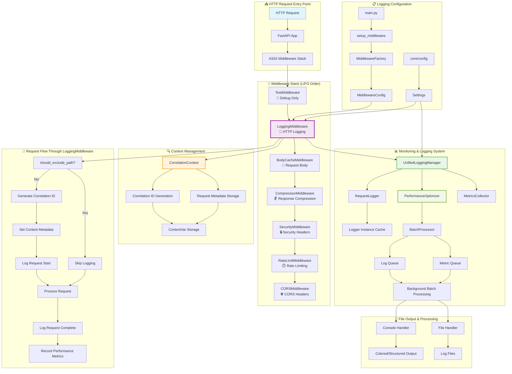

# 📊 Анализ архитектуры логирования HTTP запросов

## 🎯 Обзор

Данный документ содержит полный анализ архитектуры системы логирования HTTP запросов в проекте Construction Materials API. Анализ включает диаграмму архитектуры, описание всех компонентов и путей обработки данных.

**Дата анализа:** 19 июня 2025  
**Версия системы:** v1.0  
**Статус:** ✅ Активная система с оптимизацией производительности

---

## 🏗️ Диаграмма архитектуры



---

## 🔍 Детальный анализ компонентов

### 1. 📥 Точка входа HTTP запросов

#### **main.py**
- **Роль:** Главная точка инициализации FastAPI приложения
- **Функции:**
  - Настройка структурированного логирования
  - Инициализация middleware stack через `setup_middleware()`
  - Временное добавление `TestMiddleware` для отладки
  - Настройка UTF-8 JSON ответов

```python
# Пример инициализации
setup_structured_logging(
    log_level=settings.LOG_LEVEL,
    enable_structured=settings.ENABLE_STRUCTURED_LOGGING,
    log_file=settings.LOG_FILE
)
```

### 2. 🔧 Middleware Stack (порядок LIFO)

#### **TestMiddleware** 🧪
- **Файл:** `test_middleware.py`
- **Статус:** Временный отладочный middleware
- **Функции:**
  - Простое логирование входящих запросов
  - Измерение времени обработки
  - Отладочный вывод в консоль

#### **LoggingMiddleware** 📝
- **Файл:** `core/middleware/logging.py`
- **Статус:** ✅ Основной компонент системы
- **Ключевые функции:**
  - Генерация уникальных correlation ID
  - Логирование начала и завершения запросов
  - Интеграция с UnifiedLoggingManager
  - Исключение служебных путей (/health, /docs)
  - Производительностная оптимизация

```python
class LoggingMiddleware:
    def __init__(self, app: ASGIApp):
        self.unified_manager = get_unified_logging_manager()
        self.enable_performance_optimization = True
        self.enable_batching = True
```

#### **Другие Middleware**
- **BodyCacheMiddleware:** Кеширование тела запроса
- **CompressionMiddleware:** Сжатие ответов (Brotli/Gzip)
- **SecurityMiddleware:** Безопасность и заголовки
- **RateLimitMiddleware:** Ограничение скорости запросов
- **CORSMiddleware:** CORS настройки

### 3. 📊 Система мониторинга и логирования

#### **UnifiedLoggingManager**
- **Файл:** `core/monitoring/unified_manager.py`
- **Роль:** Центральный координатор всего логирования
- **Функции:**
  - Управление RequestLogger
  - Интеграция с PerformanceOptimizer
  - Сбор метрик производительности
  - Унифицированное API для логирования

#### **RequestLogger**
- **Файл:** `core/monitoring/logger.py`
- **Функции:**
  - Структурированное логирование HTTP запросов
  - Correlation ID tracking
  - Метаданные запросов (IP, User-Agent, размеры)

#### **PerformanceOptimizer**
- **Файл:** `core/monitoring/performance_optimizer.py`
- **Функции:**
  - Кеширование logger instances
  - Батчевая обработка логов
  - Асинхронная обработка в фоне
  - Оптимизированная JSON сериализация

#### **BatchProcessor**
- **Компоненты:**
  - Log Queue (очередь логов)
  - Metric Queue (очередь метрик)
  - Background processing (фоновая обработка)
  - Flush intervals (интервалы сброса)

### 4. 🔍 Управление контекстом

#### **CorrelationContext**
- **Файл:** `core/monitoring/context.py`
- **Функции:**
  - Thread-safe управление correlation ID
  - ContextVar для async-safe storage
  - Propagation через все компоненты
  - Request metadata management

```python
# Генерация correlation ID
correlation_id = str(uuid.uuid4())
set_correlation_id(correlation_id)
```

### 5. 📋 Конфигурация системы

#### **MiddlewareFactory**
- **Файл:** `core/middleware/factory.py`
- **Функции:**
  - Централизованное создание middleware stack
  - Конфигурация параметров для каждого middleware
  - Обработка ошибок инициализации

#### **Settings**
- **Источник:** `core/config/`
- **Параметры:**
  - `ENABLE_REQUEST_LOGGING`
  - `ENABLE_PERFORMANCE_OPTIMIZATION`
  - `ENABLE_LOG_BATCHING`
  - `LOG_EXCLUDE_PATHS`

---

## 🔄 Полный путь обработки HTTP запроса

### Этап 1: Вход в систему
1. **HTTP Request** поступает в **FastAPI App**
2. Запрос передается в **ASGI Middleware Stack**
3. Middleware выполняются в порядке LIFO

### Этап 2: LoggingMiddleware обработка
1. **Проверка исключений:** `should_exclude_path()`
   - Исключаются: `/health`, `/docs`, `/openapi.json`, `/favicon.ico`
2. **Генерация Correlation ID:** `str(uuid.uuid4())`
3. **Установка контекста:** метаданные запроса в ContextVar
4. **Логирование начала:** структурированный лог с correlation ID
5. **Обработка запроса:** передача в следующие middleware
6. **Логирование завершения:** лог с результатом и временем
7. **Метрики:** запись производственных показателей

### Этап 3: Система мониторинга
1. **UnifiedLoggingManager** координирует логирование
2. **RequestLogger** формирует структурированные записи
3. **PerformanceOptimizer** обеспечивает батчинг
4. **BatchProcessor** обрабатывает логи асинхронно

### Этап 4: Вывод результатов
1. **Console Handler:** цветной/структурированный вывод
2. **File Handler:** запись в файлы логов
3. **Background Processing:** асинхронная обработка батчей

---

## 📈 Производительностные оптимизации

### 1. **Кеширование**
- Logger instance cache (LRU, max 1000)
- Correlation ID caching
- JSON serialization cache

### 2. **Батчинг**
- Log batching (batch_size: 100)
- Metric batching
- Background flush (interval: 1.0s)

### 3. **Асинхронность**
- Background batch processing
- ThreadPoolExecutor (max 2 workers)
- Non-blocking log operations

### 4. **Оптимизация памяти**
- WeakValueDictionary для cache
- Deque для очередей (maxlen: 10000)
- Оптимизированный JSON encoder

---

## 📊 Анализ логов системы

### Инициализация системы:
```
INFO [754b0d79-6b5d-4411-91c6-3767397b4cc1] 🔧 Setting up middleware stack...
INFO [754b0d79-6b5d-4411-91c6-3767397b4cc1] ✅ SecurityMiddleware initialized
INFO [754b0d79-6b5d-4411-91c6-3767397b4cc1] ✅ CompressionMiddleware initialized
INFO [754b0d79-6b5d-4411-91c6-3767397b4cc1] ✅ BodyCacheMiddleware initialized
INFO [754b0d79-6b5d-4411-91c6-3767397b4cc1] ✅ LoggingMiddleware initialized
```

### Обработка HTTP запросов:
```
🧪 TestMiddleware: GET /
🧪 TestMiddleware completed: GET / (15.19ms)
```

### Производительность:
- **Время обработки:** 15.19ms для GET /
- **Compression:** Brotli enabled (level 6)
- **Optimization:** performance=True, batching=True

---

## 🎯 Ключевые особенности архитектуры

### ✅ **Преимущества:**

1. **Полная трассировка:** каждый запрос имеет уникальный correlation ID
2. **Производительность:** кеширование, батчинг, асинхронность
3. **Структурированность:** JSON логи с метаданными
4. **Гибкость:** настраиваемые исключения и уровни логирования
5. **Отказоустойчивость:** graceful handling ошибок middleware

### 🔧 **Технические решения:**

- **Thread-safe:** ContextVar для async/sync compatibility
- **Memory-efficient:** WeakValueDictionary и deque с ограничениями
- **Performance-first:** LRU cache и batch processing
- **Monitoring-ready:** интеграция с метриками и health checks

### 📋 **Конфигурируемость:**

- Исключение путей из логирования
- Настройка batch размеров и интервалов
- Уровни логирования для разных компонентов
- Включение/выключение оптимизаций

---

## 🔮 Рекомендации по развитию

### 1. **Monitoring Enhancement**
- Добавить integration с Prometheus/Grafana
- Реализовать alerting на критические ошибки
- Расширить health checks с детальной диагностикой

### 2. **Performance Optimization**
- Implement connection pooling для external services
- Add request/response size optimization
- Consider distributed tracing (OpenTelemetry)

### 3. **Security Improvements**
- Enhanced correlation ID security (не UUID в продакшн)
- PII data masking в логах
- Audit trail для чувствительных операций

### 4. **Scalability**
- Horizontal scaling ready architecture
- Load balancer aware correlation propagation
- Distributed caching strategy

---

## 📚 Связанные документы

- [Database Architecture](DATABASE_ARCHITECTURE.md)
- [API Documentation](API_DOCUMENTATION.md)
- [Troubleshooting Guide](TROUBLESHOOTING.md)
- [Unified Logging System Plan](../PLAN_DOCS/UNIFIED_LOGGING_SYSTEM_PLAN.md)

---

**Создано:** 19 июня 2025  
**Автор:** AI Analysis System  
**Версия документа:** 1.0 