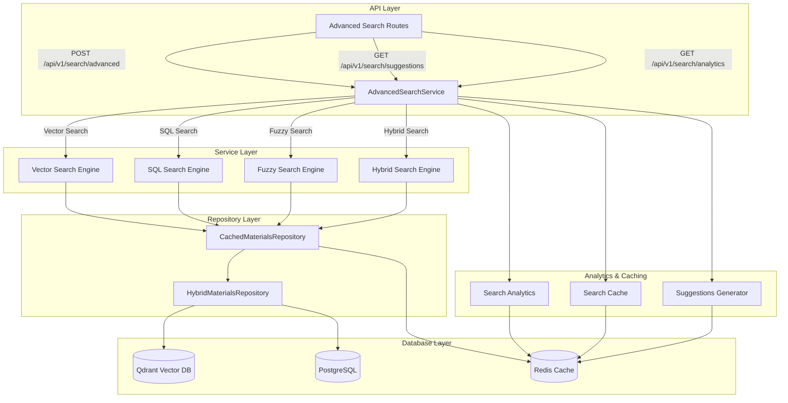

# Stage 5: Advanced Search and Filtering

## Обзор / Overview

**Stage 5** реализует продвинутые возможности поиска и фильтрации для RAG Construction Materials API, предоставляя пользователям мощные инструменты для точного поиска материалов с комплексной фильтрацией, аналитикой и оптимизацией производительности.

**Stage 5** implements advanced search and filtering capabilities for the RAG Construction Materials API, providing users with powerful tools for precise material search with comprehensive filtering, analytics, and performance optimization.

## Ключевые возможности / Key Features

### 🔍 Продвинутые типы поиска / Advanced Search Types
- **Vector Search**: Семантический поиск с использованием эмбеддингов
- **SQL Search**: Традиционный текстовый поиск с PostgreSQL
- **Fuzzy Search**: Нечеткий поиск с настраиваемой толерантностью
- **Hybrid Search**: Комбинированный поиск с весовыми коэффициентами

### 🎯 Комплексная фильтрация / Comprehensive Filtering
- **Категории**: Фильтрация по типам материалов
- **Единицы измерения**: Фильтрация по единицам (кг, м, м², м³, шт)
- **SKU паттерны**: Поиск по шаблонам артикулов с wildcards
- **Диапазоны дат**: Фильтрация по датам создания/обновления
- **Пороги схожести**: Настраиваемые пороги для поиска

### 📊 Сортировка и пагинация / Sorting and Pagination
- **Мульти-поле сортировка**: Сортировка по нескольким полям
- **Cursor-based пагинация**: Эффективная пагинация больших наборов
- **Настраиваемые направления**: Ascending/Descending для каждого поля

### 💡 Интеллектуальные функции / Smart Features
- **Автодополнение**: Предложения на основе популярных запросов
- **Подсветка текста**: HTML-подсветка совпадений в результатах
- **Поисковая аналитика**: Трекинг и анализ поисковых запросов
- **Популярные запросы**: Статистика часто используемых запросов

## Архитектура / Architecture



## Компоненты / Components

### 1. AdvancedSearchService

Основной сервис для продвинутого поиска с поддержкой всех типов поиска и фильтрации.

**Основные методы:**
- `advanced_search()` - Главный метод поиска
- `_vector_search()` - Векторный поиск
- `_sql_search()` - SQL поиск
- `_fuzzy_search()` - Нечеткий поиск
- `_hybrid_search()` - Гибридный поиск
- `_apply_filters()` - Применение фильтров
- `_apply_sorting()` - Применение сортировки
- `_apply_pagination()` - Применение пагинации

### 2. Advanced Search Routes

API эндпоинты для продвинутого поиска:

```python
# Основной продвинутый поиск
POST /api/v1/search/advanced

# Автодополнение
GET /api/v1/search/suggestions?q=цем

# Популярные запросы
GET /api/v1/search/popular-queries

# Аналитика поиска
GET /api/v1/search/analytics

# Доступные категории
GET /api/v1/search/categories

# Доступные единицы
GET /api/v1/search/units

# Нечеткий поиск
POST /api/v1/search/fuzzy

# Проверка здоровья
GET /api/v1/search/health
```

### 3. Схемы данных / Data Schemas

#### AdvancedSearchQuery
```python
{
    "query": "цемент портландский",
    "search_type": "hybrid",
    "filters": {
        "categories": ["Цемент"],
        "units": ["кг"],
        "created_after": "2024-01-01T00:00:00",
        "min_similarity": 0.5
    },
    "sort_by": [
        {"field": "relevance", "direction": "desc"},
        {"field": "created_at", "direction": "desc"}
    ],
    "pagination": {
        "page": 1,
        "page_size": 20
    },
    "fuzzy_threshold": 0.8,
    "include_suggestions": true,
    "highlight_matches": true
}
```

#### SearchResponse
```python
{
    "results": [...],
    "total_count": 150,
    "page": 1,
    "page_size": 20,
    "total_pages": 8,
    "search_time_ms": 45.2,
    "suggestions": [...],
    "filters_applied": {...},
    "next_cursor": "eyJwYWdlIjoyLCJ0b3RhbCI6MTUwfQ=="
}
```

## Примеры использования / Usage Examples

### 1. Базовый продвинутый поиск

```python
import httpx

# Продвинутый поиск с фильтрацией
search_query = {
    "query": "цемент",
    "search_type": "hybrid",
    "filters": {
        "categories": ["Цемент"],
        "units": ["кг"],
        "min_similarity": 0.7
    },
    "sort_by": [
        {"field": "relevance", "direction": "desc"}
    ],
    "pagination": {
        "page": 1,
        "page_size": 10
    },
    "highlight_matches": True,
    "include_suggestions": True
}

async with httpx.AsyncClient() as client:
    response = await client.post(
        "http://localhost:8000/api/v1/search/advanced",
        json=search_query
    )
    result = response.json()
    
    print(f"Found {result['total_count']} materials")
    for item in result['results']:
        print(f"- {item['material']['name']} (score: {item['score']:.3f})")
```

### 2. Нечеткий поиск

```python
# Нечеткий поиск с настраиваемым порогом
async with httpx.AsyncClient() as client:
    response = await client.post(
        "http://localhost:8000/api/v1/search/fuzzy",
        params={
            "q": "цемнт",  # Опечатка в слове "цемент"
            "threshold": 0.8,
            "limit": 5
        }
    )
    materials = response.json()
    
    for material in materials:
        print(f"- {material['name']}")
```

### 3. Автодополнение

```python
# Получение предложений для автодополнения
async with httpx.AsyncClient() as client:
    response = await client.get(
        "http://localhost:8000/api/v1/search/suggestions",
        params={"q": "цем", "limit": 5}
    )
    suggestions = response.json()
    
    for suggestion in suggestions:
        print(f"- {suggestion['text']} ({suggestion['type']})")
```

### 4. Комплексная фильтрация

```python
# Поиск с множественными фильтрами
search_query = {
    "query": "строительные материалы",
    "search_type": "hybrid",
    "filters": {
        "categories": ["Цемент", "Кирпич", "Металлопрокат"],
        "units": ["кг", "шт", "м"],
        "sku_pattern": "*001",
        "created_after": "2024-01-01T00:00:00",
        "created_before": "2024-12-31T23:59:59",
        "min_similarity": 0.6
    },
    "sort_by": [
        {"field": "use_category", "direction": "asc"},
        {"field": "name", "direction": "asc"}
    ],
    "pagination": {
        "page": 1,
        "page_size": 20
    }
}
```

### 5. Аналитика поиска

```python
# Получение аналитики поиска
async with httpx.AsyncClient() as client:
    response = await client.get(
        "http://localhost:8000/api/v1/search/analytics",
        params={
            "start_date": "2024-01-01T00:00:00",
            "end_date": "2024-01-31T23:59:59"
        }
    )
    analytics = response.json()
    
    print(f"Total searches: {analytics['total_searches']}")
    print(f"Average time: {analytics['avg_search_time']:.2f}ms")
    print("Popular queries:")
    for query in analytics['popular_queries'][:5]:
        print(f"- '{query['query']}': {query['count']} searches")
```

## Алгоритмы нечеткого поиска / Fuzzy Search Algorithms

### 1. Levenshtein Distance
Вычисляет минимальное количество операций редактирования для преобразования одной строки в другую.

```python
def levenshtein_similarity(s1: str, s2: str) -> float:
    """Calculate Levenshtein similarity (0.0 to 1.0)."""
    max_len = max(len(s1), len(s2))
    if max_len == 0:
        return 1.0
    
    distance = levenshtein_distance(s1, s2)
    return 1.0 - (distance / max_len)
```

### 2. Sequence Matcher
Использует алгоритм схожести последовательностей Python для вычисления коэффициента схожести.

```python
from difflib import SequenceMatcher

def sequence_matcher_similarity(s1: str, s2: str) -> float:
    """Calculate similarity using SequenceMatcher."""
    return SequenceMatcher(None, s1, s2).ratio()
```

### 3. Weighted Field Scoring
Комбинирует схожести по разным полям с весовыми коэффициентами:

```python
field_weights = {
    'name': 0.4,        # 40% - название материала
    'description': 0.3,  # 30% - описание
    'use_category': 0.2, # 20% - категория
    'sku': 0.1          # 10% - артикул
}
```

## Производительность / Performance

### Бенчмарки поиска / Search Benchmarks

| Тип поиска | Среднее время | Точность | Использование |
|------------|---------------|----------|---------------|
| Vector     | 15-25ms       | Высокая  | Семантический поиск |
| SQL        | 10-20ms       | Средняя  | Точные совпадения |
| Fuzzy      | 50-100ms      | Высокая  | Поиск с опечатками |
| Hybrid     | 30-60ms       | Очень высокая | Универсальный |

### Оптимизация производительности / Performance Optimization

1. **Кеширование результатов**:
   - Результаты поиска кешируются в Redis на 5 минут
   - Предложения кешируются на 1 час
   - Аналитика кешируется на 1 день

2. **Параллельное выполнение**:
   - Гибридный поиск выполняет все типы поиска параллельно
   - Фильтрация и сортировка оптимизированы для больших наборов

3. **Пагинация**:
   - Cursor-based пагинация для эффективной работы с большими результатами
   - Ограничение размера страницы до 100 элементов

## Конфигурация / Configuration

### Настройки поиска / Search Settings

```python
# services/advanced_search.py
class AdvancedSearchService:
    def __init__(self):
        # Веса для разных типов поиска
        self.search_weights = {
            'vector': 0.5,
            'sql': 0.3,
            'fuzzy': 0.2
        }
        
        # Веса полей для нечеткого поиска
        self.field_weights = {
            'name': 0.4,
            'description': 0.3,
            'use_category': 0.2,
            'sku': 0.1
        }
        
        # Настройки кеширования
        self.cache_ttl = {
            'search_results': 300,    # 5 минут
            'suggestions': 3600,      # 1 час
            'analytics': 86400        # 1 день
        }
```

### Переменные окружения / Environment Variables

```bash
# Настройки поиска
SEARCH_DEFAULT_PAGE_SIZE=20
SEARCH_MAX_PAGE_SIZE=100
SEARCH_DEFAULT_FUZZY_THRESHOLD=0.8
SEARCH_ANALYTICS_ENABLED=true

# Настройки кеширования
SEARCH_CACHE_TTL_RESULTS=300
SEARCH_CACHE_TTL_SUGGESTIONS=3600
SEARCH_CACHE_TTL_ANALYTICS=86400

# Настройки производительности
SEARCH_PARALLEL_EXECUTION=true
SEARCH_MAX_CONCURRENT_SEARCHES=10
```

## Мониторинг и аналитика / Monitoring and Analytics

### Метрики поиска / Search Metrics

1. **Производительность**:
   - Время выполнения поиска
   - Количество результатов
   - Коэффициент попаданий в кеш

2. **Использование**:
   - Популярные запросы
   - Типы поиска
   - Применяемые фильтры

3. **Качество**:
   - Коэффициенты схожести
   - Пустые результаты
   - Повторные поиски

### Дашборд аналитики / Analytics Dashboard

```python
# Получение метрик для дашборда
async def get_search_dashboard_metrics():
    analytics = await search_service.get_search_analytics()
    
    return {
        "total_searches_today": analytics["daily_stats"][today]["searches"],
        "avg_response_time": analytics["avg_search_time"],
        "popular_queries": analytics["popular_queries"][:10],
        "search_types_distribution": analytics["search_types"],
        "cache_hit_rate": await get_cache_hit_rate()
    }
```

## Безопасность / Security

### Защита от злоупотреблений / Abuse Protection

1. **Rate Limiting**:
   - Ограничение количества запросов на пользователя
   - Защита от спама и DDoS атак

2. **Валидация входных данных**:
   - Проверка размеров запросов
   - Санитизация поисковых запросов
   - Ограничение сложности фильтров

3. **Мониторинг подозрительной активности**:
   - Отслеживание аномальных паттернов поиска
   - Логирование всех поисковых запросов

## Развертывание / Deployment

### Docker конфигурация

```dockerfile
# Dockerfile для продвинутого поиска
FROM python:3.9-slim

WORKDIR /app

COPY requirements.txt .
RUN pip install -r requirements.txt

COPY . .

# Настройки для продвинутого поиска
ENV SEARCH_ANALYTICS_ENABLED=true
ENV SEARCH_CACHE_TTL_RESULTS=300

EXPOSE 8000

CMD ["uvicorn", "main:app", "--host", "0.0.0.0", "--port", "8000"]
```

### Kubernetes конфигурация

```yaml
apiVersion: apps/v1
kind: Deployment
metadata:
  name: advanced-search-api
spec:
  replicas: 3
  selector:
    matchLabels:
      app: advanced-search-api
  template:
    metadata:
      labels:
        app: advanced-search-api
    spec:
      containers:
      - name: api
        image: rag-materials-api:latest
        ports:
        - containerPort: 8000
        env:
        - name: SEARCH_ANALYTICS_ENABLED
          value: "true"
        - name: REDIS_HOST
          value: "redis-service"
        - name: QDRANT_HOST
          value: "qdrant-service"
        - name: POSTGRES_HOST
          value: "postgres-service"
        resources:
          requests:
            memory: "512Mi"
            cpu: "250m"
          limits:
            memory: "1Gi"
            cpu: "500m"
```

## Тестирование / Testing

### Unit тесты

```bash
# Запуск тестов продвинутого поиска
pytest tests/test_advanced_search.py -v

# Тесты с покрытием
pytest tests/test_advanced_search.py --cov=services.advanced_search
```

### Интеграционные тесты

```bash
# Тесты с реальными БД
pytest tests/test_advanced_search.py -m integration

# Нагрузочные тесты
pytest tests/test_advanced_search.py -m performance
```

### Демо-скрипт

```bash
# Запуск демонстрации
python utils/demo_advanced_search.py
```

## Устранение неполадок / Troubleshooting

### Частые проблемы / Common Issues

1. **Медленный поиск**:
   - Проверить подключение к Redis
   - Оптимизировать индексы в PostgreSQL
   - Увеличить размер пула соединений

2. **Неточные результаты**:
   - Настроить веса полей
   - Изменить пороги схожести
   - Проверить качество эмбеддингов

3. **Ошибки кеширования**:
   - Проверить доступность Redis
   - Очистить кеш поиска
   - Проверить TTL настройки

### Логирование / Logging

```python
# Настройка логирования для поиска
import logging

logging.getLogger("services.advanced_search").setLevel(logging.INFO)
logging.getLogger("core.repositories.cached_materials").setLevel(logging.DEBUG)
```

## Roadmap / Дорожная карта

### Планируемые улучшения / Planned Improvements

1. **Q1 2024**:
   - Машинное обучение для ранжирования результатов
   - Персонализированные рекомендации
   - A/B тестирование поисковых алгоритмов

2. **Q2 2024**:
   - Поиск по изображениям материалов
   - Голосовой поиск
   - Интеграция с внешними каталогами

3. **Q3 2024**:
   - Федеративный поиск по нескольким источникам
   - Автоматическая категоризация материалов
   - Предиктивная аналитика спроса

## Заключение / Conclusion

Stage 5 предоставляет мощную и гибкую систему продвинутого поиска, которая значительно улучшает пользовательский опыт при работе с каталогом строительных материалов. Комбинация различных типов поиска, интеллектуальной фильтрации и аналитики делает систему готовой для производственного использования в крупных проектах.

Stage 5 provides a powerful and flexible advanced search system that significantly improves user experience when working with construction materials catalog. The combination of different search types, intelligent filtering, and analytics makes the system ready for production use in large-scale projects. 