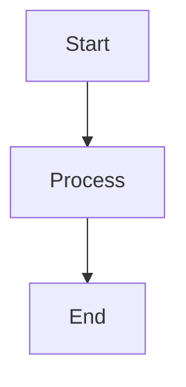
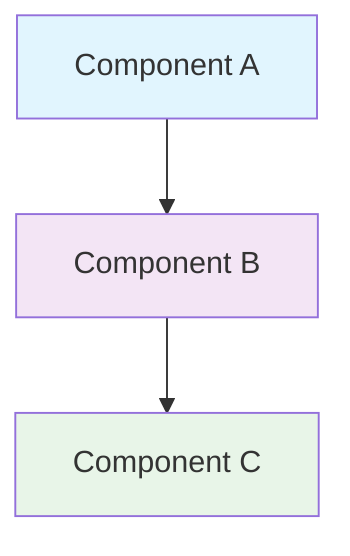

# 📊 Диаграммы архитектуры системы

## 🎯 Обзор

Данная директория содержит диаграммы архитектуры системы в формате Mermaid, которые можно использовать для документации, презентаций и визуализации.

## 📁 Файлы диаграмм

### `http_logging_architecture.mermaid`
- **Описание:** Полная диаграмма архитектуры системы логирования HTTP запросов
- **Компоненты:** 
  - HTTP Request flow через FastAPI
  - Middleware Stack (LIFO порядок)
  - Система мониторинга и логирования
  - Context Management
  - Конфигурация системы
  - Обработка выходных данных

## 🔧 Как использовать диаграммы

### 1. **Онлайн просмотр**
Вставьте содержимое `.mermaid` файла в:
- [Mermaid Live Editor](https://mermaid.live/)
- [GitHub Markdown](https://github.com/) (поддерживает Mermaid)
- [GitLab](https://gitlab.com/) (поддерживает Mermaid)

### 2. **VS Code**
Установите расширение:
- **Mermaid Preview** для просмотра диаграмм
- **Markdown Preview Enhanced** для интеграции

### 3. **Экспорт в изображения**
Используйте Mermaid CLI:
```bash
# Установка
npm install -g @mermaid-js/mermaid-cli

# Экспорт в PNG
mmdc -i http_logging_architecture.mermaid -o http_logging_architecture.png

# Экспорт в SVG
mmdc -i http_logging_architecture.mermaid -o http_logging_architecture.svg

# Экспорт в PDF
mmdc -i http_logging_architecture.mermaid -o http_logging_architecture.pdf
```

### 4. **Интеграция в документацию**
```markdown
# В Markdown файле


### 5. **Confluence/Notion**
- Confluence: используйте Mermaid macro
- Notion: используйте блок "Code" с языком "mermaid"

## 🎨 Цветовая схема

Диаграммы используют следующую цветовую схему:
- **Голубой** (#e1f5fe): Точки входа HTTP запросов
- **Фиолетовый** (#f3e5f5): Основные middleware компоненты  
- **Зеленый** (#e8f5e8): Система мониторинга
- **Оранжевый** (#fff3e0): Context Management
- **Салатовый** (#f1f8e9): Performance компоненты

## 📋 Обновление диаграмм

При изменении архитектуры системы:

1. **Обновите соответствующий `.mermaid` файл**
2. **Проверьте синтаксис** в Mermaid Live Editor
3. **Обновите основной документ** `HTTP_LOGGING_ARCHITECTURE_ANALYSIS.md`
4. **Сгенерируйте новые изображения** (если используются)

## 🔗 Связанные документы

- [HTTP Logging Architecture Analysis](../HTTP_LOGGING_ARCHITECTURE_ANALYSIS.md)
- [Database Architecture](../DATABASE_ARCHITECTURE.md)
- [API Documentation](../API_DOCUMENTATION.md)

## 📝 Шаблоны новых диаграмм

### Базовый шаблон:


---

**Создано:** 19 июня 2025  
**Автор:** Development Team  
**Версия:** 1.0 