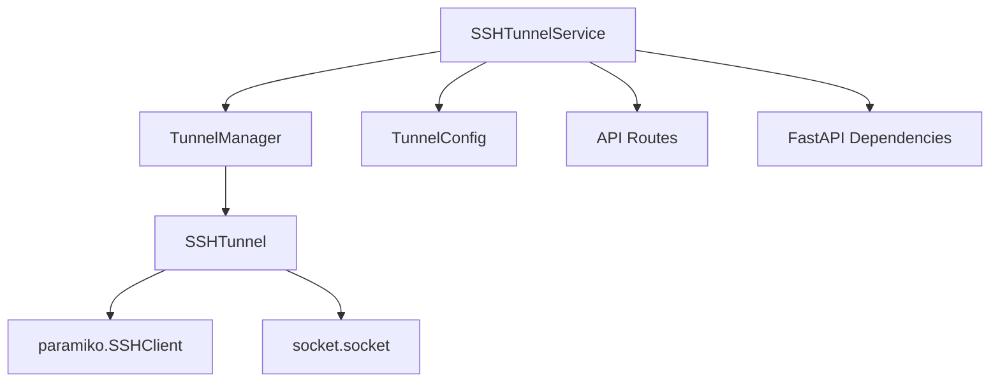

# SSH Tunnel Module

Модуль для автоматического управления SSH туннелями в RAG Construction Materials API.

## Обзор

SSH Tunnel Module обеспечивает автоматическое создание и управление SSH туннелями для безопасного подключения к удаленным базам данных. Модуль интегрирован с FastAPI lifecycle и предоставляет REST API для управления.

## Архитектура



## Основные компоненты

### 1. SSHTunnelService
Главный сервис для управления SSH туннелями.

```python
from services.ssh_tunnel_service import SSHTunnelService

service = SSHTunnelService()
await service.start_service()
```

**Возможности:**
- Автоматический запуск/остановка
- Фоновый мониторинг с heartbeat проверками
- Интеграция с FastAPI lifespan
- Автоматическое переподключение при сбоях

### 2. TunnelManager
Менеджер жизненного цикла туннеля.

```python
from services.tunnel.tunnel_manager import TunnelManager
from services.tunnel.tunnel_config import TunnelConfig

config = TunnelConfig.create_dev_config()
manager = TunnelManager(config)
await manager.start_tunnel()
```

**Возможности:**
- Управление жизненным циклом туннеля
- Health checks и мониторинг
- Retry логика с экспоненциальным backoff
- Детальные метрики и статистика

### 3. SSHTunnel
Базовый класс для SSH подключений.

```python
from services.tunnel.ssh_tunnel import SSHTunnel

tunnel = SSHTunnel(config)
await tunnel.connect()
```

**Возможности:**
- Создание SSH туннеля с paramiko
- Обработка множественных подключений
- Relay данных между клиентом и сервером
- Health checks подключения

### 4. TunnelConfig
Конфигурация с валидацией параметров.

```python
from services.tunnel.tunnel_config import TunnelConfig

# Создание из настроек приложения
config = TunnelConfig.from_settings(settings)

# Профили для разных сред
dev_config = TunnelConfig.create_dev_config()
prod_config = TunnelConfig.create_prod_config()
```

**Возможности:**
- Pydantic валидация всех параметров
- Проверка SSH ключей и permissions
- Профили для разных сред
- Безопасная обработка конфигурации

### 5. Exception Hierarchy
Типизированная система исключений.

```python
from services.tunnel.exceptions import (
    SSHTunnelError,
    SSHTunnelConnectionError,
    SSHTunnelConfigError,
    SSHTunnelTimeoutError,
    SSHTunnelAuthenticationError,
    SSHTunnelKeyError
)
```

## Использование

### Базовое использование

```python
from services.ssh_tunnel_service import initialize_tunnel_service

# Инициализация при старте приложения
tunnel_service = await initialize_tunnel_service()

if tunnel_service:
    print("SSH tunnel service запущен")
    status = tunnel_service.get_status()
    print(f"Статус: {status}")
```

### Конфигурация через переменные окружения

```bash
# Включение SSH туннеля
ENABLE_SSH_TUNNEL=true

# Параметры подключения
SSH_TUNNEL_LOCAL_PORT=5435
SSH_TUNNEL_REMOTE_HOST=31.130.148.200
SSH_TUNNEL_REMOTE_USER=root
SSH_TUNNEL_REMOTE_PORT=5432
SSH_TUNNEL_KEY_PATH=~/.ssh/postgres_key

# Настройки таймаутов и повторов
SSH_TUNNEL_TIMEOUT=30
SSH_TUNNEL_RETRY_ATTEMPTS=3
SSH_TUNNEL_RETRY_DELAY=5

# Мониторинг
SSH_TUNNEL_HEARTBEAT_INTERVAL=60
SSH_TUNNEL_AUTO_RESTART=true
```

### FastAPI Integration

```python
from services.ssh_tunnel_service import tunnel_service_lifespan

@asynccontextmanager
async def lifespan(app: FastAPI):
    # Автоматический запуск SSH туннеля
    async with tunnel_service_lifespan() as tunnel_service:
        if tunnel_service:
            app.state.tunnel_service = tunnel_service
        yield

app = FastAPI(lifespan=lifespan)
```

### Dependency Injection

```python
from core.dependencies.tunnel import RequiredTunnelService, TunnelService

@app.get("/api/v1/tunnel/status")
async def get_tunnel_status(tunnel_service: TunnelService):
    if tunnel_service is None:
        return {"status": "unavailable"}
    return tunnel_service.get_status()

@app.post("/api/v1/tunnel/restart")
async def restart_tunnel(tunnel_service: RequiredTunnelService):
    success = await tunnel_service.restart_service()
    return {"success": success}
```

## API Endpoints

### Health Check
```http
GET /api/v1/tunnel/health
```
Проверка доступности SSH туннеля.

**Response:**
```json
{
    "status": "healthy|unhealthy|unavailable",
    "tunnel_active": true,
    "service_running": true
}
```

### Статус сервиса
```http
GET /api/v1/tunnel/status
```
Подробный статус SSH туннель сервиса.

**Response:**
```json
{
    "service_running": true,
    "config_enabled": true,
    "tunnel_manager": {
        "active": true,
        "config": "root@31.130.148.200:5432 -> localhost:5435",
        "uptime_seconds": 3600.0,
        "restart_count": 0
    }
}
```

### Метрики
```http
GET /api/v1/tunnel/metrics
```
Детальные метрики производительности.

**Response:**
```json
{
    "active": true,
    "config": "root@31.130.148.200:5432 -> localhost:5435",
    "uptime_seconds": 3600.0,
    "metrics": {
        "availability": {
            "uptime_percentage": 0.99,
            "health_success_rate": 0.95,
            "restart_frequency": 0.1
        },
        "performance": {
            "total_bytes_transferred": 1048576,
            "connection_attempts": 5,
            "successful_connections": 4,
            "failed_connections": 1
        }
    }
}
```

### Управление туннелем
```http
POST /api/v1/tunnel/start   # Запуск
POST /api/v1/tunnel/stop    # Остановка  
POST /api/v1/tunnel/restart # Перезапуск
```

**Response:**
```json
{
    "message": "SSH tunnel service started successfully",
    "success": true
}
```

### Конфигурация
```http
GET /api/v1/tunnel/config
```
Получение конфигурации (без секретных данных).

**Response:**
```json
{
    "config": {
        "enabled": true,
        "local_port": 5435,
        "remote_host": "31.130.148.200",
        "remote_user": "root",
        "remote_port": 5432,
        "timeout": 30,
        "retry_attempts": 3,
        "auto_restart": true
    }
}
```

## Мониторинг и логирование

### Логирование
Модуль использует структурированное логирование:

```python
import logging

logger = logging.getLogger("services.tunnel")
logger.setLevel(logging.INFO)
```

**Логируются:**
- Все попытки подключения и их результаты
- Health check результаты
- Ошибки и исключения
- Статистика передачи данных
- Lifecycle события (startup/shutdown)

### Метрики
Собираются следующие метрики:
- **Availability**: uptime %, success rate, restart frequency
- **Performance**: bytes transferred, connection stats
- **Health**: health check frequency and results
- **Errors**: error counts by type

## Безопасность

### SSH Key Management
- Автоматическая проверка существования SSH ключей
- Валидация permissions (должны быть 600 или аналогичные)
- Поддержка RSA, DSA, ECDSA ключей
- Расширение путей с `~` (home directory)

### API Security
- Секретные данные (SSH ключи) исключены из API ответов
- HTTP статус коды для разных типов ошибок
- Input validation через Pydantic модели
- Rate limiting можно настроить через middleware

### Network Security
- Bind только на localhost для tunnel endpoint
- Timeout настройки для предотвращения висячих соединений
- Graceful shutdown для корректного закрытия подключений

## Troubleshooting

### Частые проблемы

#### 1. SSH ключ не найден
```
SSHTunnelKeyError: SSH key file does not exist: /path/to/key
```

**Решение:**
- Проверить путь к SSH ключу
- Убедиться что файл существует и доступен
- Проверить permissions (должны быть 600)

#### 2. Ошибка подключения
```
SSHTunnelConnectionError: Cannot resolve hostname
```

**Решение:**
- Проверить сетевое подключение
- Убедиться что remote host доступен
- Проверить firewall настройки

#### 3. Ошибка аутентификации
```
SSHTunnelAuthenticationError: SSH authentication failed
```

**Решение:**
- Проверить SSH ключ и его соответствие remote host
- Убедиться что пользователь существует на remote host
- Проверить authorized_keys на remote host

#### 4. Timeout ошибки
```
SSHTunnelTimeoutError: SSH connection timeout after 30 seconds
```

**Решение:**
- Увеличить `SSH_TUNNEL_TIMEOUT`
- Проверить сетевую задержку до remote host
- Убедиться что SSH daemon работает на remote host

### Отладка

Включить debug логирование:
```bash
LOG_LEVEL=DEBUG
```

Проверить статус через API:
```bash
curl http://localhost:8000/api/v1/tunnel/health
curl http://localhost:8000/api/v1/tunnel/status
```

Мониторинг логов:
```bash
tail -f logs/app.log | grep tunnel
```

## Тестирование

### Unit тесты
```bash
python -m pytest tests/services/test_ssh_tunnel_service.py -v
```

### Integration тесты
```bash
# С реальными подключениями (требует SSH ключи)
python -m pytest tests/services/test_ssh_tunnel_service.py::TestSSHTunnel -v

# Только с моками
python -m pytest tests/services/test_ssh_tunnel_service.py::TestTunnelConfig -v
```

### Test Coverage
```bash
python -m pytest tests/services/test_ssh_tunnel_service.py --cov=services.tunnel --cov-report=html
```

## Performance

### Рекомендации по производительности

1. **Connection Pooling**: Туннель переиспользует подключения
2. **Efficient Data Relay**: Использует select() для bidirectional data flow
3. **Background Monitoring**: Heartbeat проверки не блокируют основные операции
4. **Resource Cleanup**: Автоматическая очистка ресурсов при shutdown

### Настройки производительности

```bash
# Частота health checks (секунды)
SSH_TUNNEL_HEARTBEAT_INTERVAL=60

# Таймауты для быстрого обнаружения проблем
SSH_TUNNEL_TIMEOUT=30

# Количество попыток переподключения
SSH_TUNNEL_RETRY_ATTEMPTS=3
```

## Расширения

### Множественные туннели
Модуль подготовлен для расширения до поддержки множественных туннелей:

```python
# Будущая возможность
configs = [
    TunnelConfig(name="postgres", local_port=5435, ...),
    TunnelConfig(name="redis", local_port=6380, ...),
]

multi_tunnel_service = MultiTunnelService(configs)
```

### Metrics Integration
Интеграция с Prometheus/Grafana:

```python
# Будущая возможность
from services.tunnel.metrics import TunnelMetricsCollector

collector = TunnelMetricsCollector()
collector.register_prometheus_metrics()
```

### Web UI
Веб-интерфейс для управления туннелями:

```python
# Будущая возможность
from services.tunnel.web_ui import TunnelWebUI

ui = TunnelWebUI(tunnel_service)
app.mount("/tunnel-ui", ui.get_app())
``` 